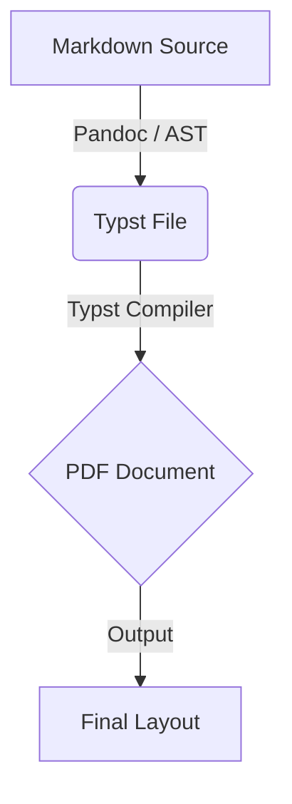

This document uses strictly standard GitHub Flavored Markdown (GFM) and standard LaTeX math.

# H1 Header

## H2 Header

### H3 Header

#### H4 Header

##### H5 Header

###### H6 Header

---

# H1 Readability Test

```{=typst}
#lorem(40)

#lorem(50)

```

## H2 Readability Test

```{=typst}
#lorem(40)

#lorem(50)

```

### H3 Readability Test

```{=typst}
#lorem(40)


```

#### H4 Readability Test

```{=typst}
#lorem(40)

#lorem(50)

```

##### H5 Readability Test

```{=typst}
#lorem(40)

#lorem(50)

```

###### H6 Readability Test

```{=typst}
#lorem(40)

#lorem(50)

```

---

## Typography & Inline Formatting

- **Bold text:** **This is bold**
- _Italic text:_ _This is italic_
- **_Bold & Italic combined:_** **_Bold italic text_**
- ~~Strikethrough text~~
- Inline `monospaced code` elements
- Standard subscript/superscript via math: $\text{H}_2\text{O}$ and $19^{\text{th}}$ century

---

## Task Checklists & Lists

- [x] Configure system environment shell
- [x] Set up local document scaffolding tool
- [ ] Implement standard GFM rendering rules

1. First sequential step
2. Second sequential step
3. Nested step A
4. Nested step B

---

## Mathematical Formulations

Inline math works like $E = mc^2$.

Display block math:

$$\begin{aligned}  \dot{\mathbf{x}}(t) &= \mathbf{A}\mathbf{x}(t) + \mathbf{B}\mathbf{u}(t) \\  \mathbf{y}(t) &= \mathbf{C}\mathbf{x}(t) + \mathbf{D}\mathbf{u}(t)  \end{aligned}$$

---

## Blockquotes

> "Engineering is about trade-offs. Understanding the tools at your disposal allows you to make deliberate choices rather than accidental ones."

---

## Aligned Data Table

| Indicator ID | Component Name           | Category | Status    | Value  |
| ------------ | ------------------------ | -------- | --------- | ------ |
| **IIP-01**   | Data Processing Pipeline | Backend  | `Active`  | 98.4%  |
| **IIP-02**   | Report Engine Generator  | CLI Tool | `Testing` | 100.0% |

---

## Code Blocks

```python
def process_metrics(dataset: list[dict]) -> dict:
    """Calculates summary statistics for public innovation indicators."""
    total = sum(item.get("score", 0) for item in dataset)
    return {"average": total / len(dataset) if dataset else 0}

```

---

## Links & References

- **Standard Link:** [TU Delft Official Portal](https://www.tudelft.nl)
- **Automatic Link:** [https://github.com](https://github.com)
- **Relative Anchor:** [Jump to Mathematical Formulations](https://www.google.com/search?q=%23mathematical-formulations)
- **Reference-style Link:** Learn more about [Typst](https://www.google.com/search?q=%5Bhttps%3A%2F%2Ftypst.app%2Fdocs%2F%5D%28https%3A%2F%2Ftypst.app%2Fdocs%2F%29) or check the [Pandoc Manual](https://www.google.com/search?q=%5Bhttps%3A%2F%2Fpandoc.org%2FMANUAL.html%5D%28https%3A%2F%2Fpandoc.org%2FMANUAL.html%29).

---

## Diagrams (Mermaid)



---

## Footnotes & Annotations

Standard GFM footnote syntax using key-value bindings:[^1]

Here is another sentence referencing a secondary note.[^2]

[^1]: Footnotes are rendered at the bottom of the page or document section by Pandoc.

[^2]: Secondary note confirming footnotes parse properly across standard AST transformations.

---

## Collapsible Sections (HTML / GFM Extension)

```text
[INFO] 2026-08-14 10:39:00 - Pipeline initialized successfully.
[INFO] 2026-08-14 10:39:01 - Parsing GFM syntax tree...
[SUCCESS] Render complete with zero compilation warnings.

```
